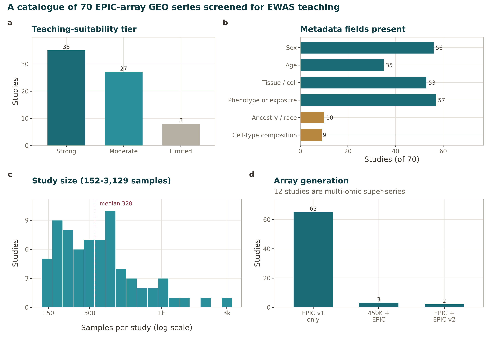

```{r}
#| label: setup
#| include: false
source("_setup.R")
library(DT)
```

In this tutorial we use one of the datasets available from the NCBI GEO database. 
You are encouraged to follow along with the tutorial using the Grady Trauma Project, 
and once you've gotten some experience following along, then practice with another 
dataset. The NCBI GEO database can be a bit tricky to navigate, so for ease, I've curated 
a catalog of 70 Illumina MethylationEPIC studies on GEO (including the dataset used in the tutorial) that carry enough phenotype
and covariate metadata to support a real association analysis. Browse it to 
understand the landscape of public EPIC data and to pick your own
dataset for a project.

The full table is downloadable as a CSV at the bottom of the page so you can
filter and load it in R or Python yourself.

## The catalog

Each row is one GEO Series. The table is searchable and sortable — click a
column header to sort, or type in the box to filter (e.g. type `Strong` to see
only the top-tier studies, or a gene/phenotype term to find studies on a
topic). The Grady Trauma Project (GSE132203) the dataset used throughout this 
tutorial, is highlighted.

```{r}
#| label: catalog-table
#| echo: false
cat70 <- read.csv("methylation_geo_catalog.csv", stringsAsFactors = FALSE, check.names = FALSE)

# Columns most useful for choosing a dataset, in a sensible order
show_cols <- c("GSE", "Title", "Suitability_tier", "Suitability_score",
               "Meth_array", "N_samples", "Has_sex", "Has_age",
               "Has_ancestry", "Has_cell_composition",
               "N_phenotype_fields", "Phenotype_examples", "PubMed")
show_cols <- show_cols[show_cols %in% colnames(cat70)]
tab <- cat70[, show_cols]

# Sort by suitability tier then score, descending
tier_rank <- c(Strong = 1, Moderate = 2, Limited = 3)
ord <- order(tier_rank[tab$Suitability_tier],
             -as.numeric(tab$Suitability_score))
tab <- tab[ord, ]

datatable(
  tab,
  rownames = FALSE,
  filter = "top",
  extensions = "Buttons",
  options = list(
    pageLength = 15,
    lengthMenu = c(10, 15, 25, 70),
    scrollX = TRUE,
    dom = "Blfrtip",
    buttons = c("copy", "csv"),
    columnDefs = list(list(
      targets = which(colnames(tab) %in% c("Title", "Phenotype_examples")) - 1,
      render = DT::JS(
        "function(data, type, row, meta){",
        "return type === 'display' && data != null && data.length > 90 ?",
        "'<span title=\"' + data + '\">' + data.substr(0, 90) + '…</span>' : data;",
        "}")
    ))
  ),
  caption = htmltools::tags$caption(
    style = "caption-side: bottom; text-align: left; font-size: 90%;",
    "70 EPIC methylation studies on GEO, ranked by teaching suitability. ",
    "Hover a truncated Title or Phenotype cell to see its full text."
  )
) |>
  formatStyle(
    "GSE",
    target = "row",
    backgroundColor = styleEqual("GSE132203", "#FFF3CD")
  )
```

## What the columns mean

| Column | Meaning |
|---|---|
| `GSE` | GEO Series accession — the identifier you give to `getGEO()` or use in the FTP path to download IDATs. |
| `Title` | The study's deposited title. |
| `Suitability_tier` / `Suitability_score` | Our teaching-suitability grade (**Strong / Moderate / Limited**) and the underlying score, based on metadata completeness (sex, age, phenotype, raw data). Higher is better for a first EWAS. |
| `Meth_array` | Array generation(s) present. Most are EPIC v1 (850K); a few mix in 450K or EPIC v2, which matters because probe IDs differ across generations. |
| `N_samples` | Total samples across all matrix files (super-series are summed). |
| `Has_sex`, `Has_age` | Whether sex and age are in the sample characteristics — both are strong methylation covariates you will almost always model. |
| `Has_ancestry` | Whether genetic ancestry / race is reported (relevant for ancestry-aware probe masking, as in [Probe filtering](03_probe_filtering.qmd)). |
| `Has_cell_composition` | Whether cell-type proportions are deposited — not necessary, but saves a step in data pre-processing if it is available. |
| `N_phenotype_fields`, `Phenotype_examples` | Count and examples of genuine phenotype/exposure variables (bare IDs excluded) — these are your candidate EWAS outcomes or exposures. |
| `PubMed` | Linked publication, where one exists. |

::: {.callout-tip}
## What makes a good *first* EWAS dataset
Sort by `Suitability_tier`, then look for: **raw IDATs deposited** (so you can
start from raw data), **both age and sex present**, at least one
**genuine phenotype** you find interesting, and ideally **whole blood or PBMC**
so you get to practice cell-type deconvolution. Deposited cell proportions values 
are a bonus — they give you an answer key to check your own pipeline against, or you can skip this step and just use the deposited cell proportions.
:::

## How the catalog was assembled

The 70 studies are the result of a deliberate screen:

1. Exported **all GEO Series for the EPIC platform** (GPL21145) from the GEO browser.
2. Restricted to *Homo sapiens*.
3. Kept studies with **≥ 150 samples** (enough for a stable EWAS).
4. Manually annotated the phenotype of interest from each title.
5. Manually removed obvious non-blood tissue and cell-differentiation studies.

Metadata was then read directly from the **Series Matrix file
header** (`GSE*_series_matrix.txt.gz`) — source name, `characteristics`
tag–value pairs, platform, and sample count. This is a quick and easy way 
to profile GEO studies without committing to downloading all the data.

```{r}
#| label: fig-catalog-overview
#| echo: false
#| fig-cap: "The 70-study catalog at a glance. (a) Teaching-suitability tiers. (b) How many studies carry each metadata field. (c) Study sizes span 152 to ~3,100 samples. (d) Almost all are EPIC v1 (850K)."

```

## The tutorial dataset

From the shortlist we chose **GSE132203**, the Grady Trauma Project, because it
is unusually complete for teaching: raw IDATs are deposited, it has explicit age
and sex plus several trauma/PTSD exposures, and it provides 
cell-type proportions, giving us answer keys to validate the deconvolution step 
against. There are also published manuscripts that we can compare our results with [@smith2011grady] [@katrinli2020ptsd].

::: {.callout-note}
## Not every study gives you IDATs
Some GEO methylation studies deposit only a processed beta-value matrix, not raw
IDATs. You can still use these for your rotation — the [Normalization](02_normalization.qmd)
notebook includes notes on how to enter the workflow from a processed matrix and
which steps you can and cannot still do.
:::

## Download the catalog

The complete 70-study catalog — all 28 columns, not just the ones shown above —
is available as a CSV:

- [**methylation_geo_catalog.csv**](methylation_geo_catalog.csv) — the full catalog, ready to load with `read_csv()` (R) or `pd.read_csv()` (Python).

You can also grab the current view directly from the table using the **CSV** and
**Copy** buttons above it.

---

**Next:** with a dataset in hand, head to [Setup](00_setup.qmd) to meet the
platform and see how the raw IDATs reach R — or jump straight to
[Quality control](01_qc.qmd) if you already know the array.
