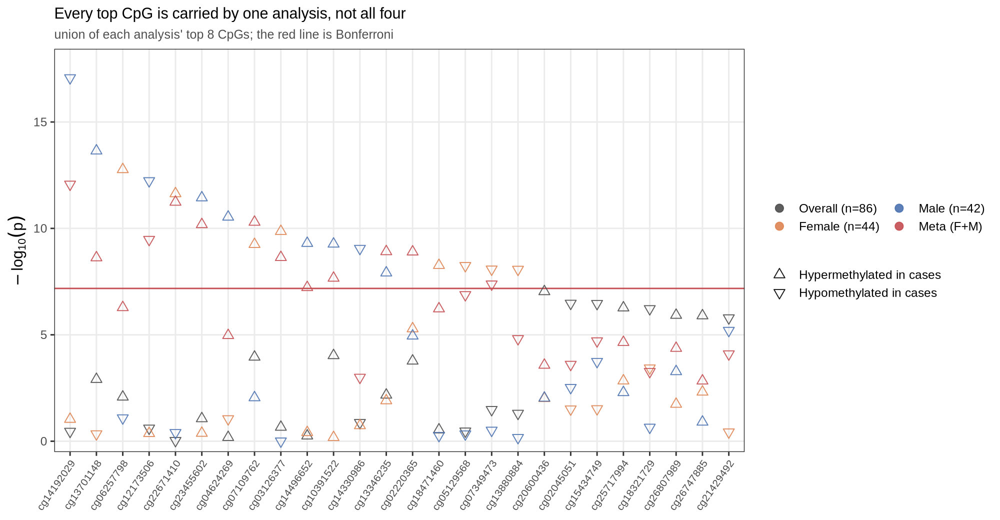

```{r}
#| label: setup
#| include: false
source("_setup.R")
```

The previous notebook fit a single association model interactively with `limma`.
Here we introduce using a scalable, reproducible Snakemake pipeline for running 
an EWAS. [Snakemake](https://snakemake.readthedocs.io) is a workflow manager: instead of running scripts in order yourself,
you declare each step as a rule with its input and output files, and Snakemake works out
what has to run, in what order, and what can run at the same time — re-running only the
steps whose inputs have changed. This EWAS snakemake pipeline automatically handles stratification, meta-analysis, annotation, and basic plotting of results (manhattan and qq plot). In addition, it can 
run a differentially methylated region (DMR) analysis. The pipeline utilizes parallelization 
and can be run on your local computer or on a remote high performance computing cluster. 
The EWAS Snakemake pipeline with installation and run instructions can be found at:
[github.com/krferrier/EWAS](https://github.com/krferrier/EWAS).

We run the whole thing here on the same Grady subset we have been using — the 86
samples with complete covariate data — across the **full filtered probe set**
(756,251 CpGs), the same matrix and the same model chapter 06 fit interactively.


## 1. The pipeline's structure {#sec-structure}

The repository is a standard Snakemake project. The pieces that matter for a
user:

| Path | Role |
|------|------|
| `config.yml` | **The only file you normally edit** — points at your data, names the association variable, toggles stratification / DMR analysis, sets chunking and compute. |
| `Snakefile` + `rules/*.smk` | The DAG: `combined_ewas`, `stratified_ewas`, `dmr`, `annotate`, `plots`. |
| `scripts/ewas.R` | Fits the per-CpG model over a chunk of CpGs; used for both the combined and stratified runs. |
| `scripts/stratify.R` | Splits the methylation + phenotype tables into per-stratum `.fst` files. |
| `scripts/run_bacon.R` | Applies BACON to a results file; writes adjusted stats + diagnostic plots. |
| `scripts/metal_cmd.sh` | Emits a METAL command file from the stratum results. |
| `software/metal/` | METAL source (built once into a binary). |

The dependency graph, conceptually:

```
             ┌─ combined EWAS ─────────────► BACON ─► plots ─┐
 mvals+pheno ┤                                               ├─► (DMR) ─► annotation
             └─ stratify ─► per-sex EWAS ─► BACON ─► METAL ──┘
                                                    meta-analysis
```

Because it is Snakemake, running `snakemake --configfile config.yml` would build every target
in that graph in dependency order and skip anything already up to date. 

## 2. Configuration {#sec-config}

The shipped `config.yml` is annotated for a BMI example; the fields we care about:

```yaml
mvals: data/mvals.csv.gz          # sample × CpG M-value matrix; col 1 = sample ID
pheno: data/pheno.csv             # sample × covariate table; col 1 = sample ID
association_variable: PTSD        # the exposure/phenotype to test
stratified_ewas: "yes"            # also run within-stratum analyses
stratify_variables: ["sex"]       # ...stratified by sex
dmr_analysis: "yes"               # region-level analysis after single-CpG
genome_build: hg38                # genome build for annotation
gene_table: refGene
chunk_size: 5000                  # CpGs per parallel task
processing_type: cluster          # sequential | multisession | multicore | cluster
workers: 4
out_type: ".csv.gz"
```

Notes:

- **`association_variable` is the whole experiment.** Everything else in
  `pheno.csv` that is *not* the sample ID or the stratify variable is treated as
  a covariate. This is worth internalising: you control the model by choosing
  the *columns you write into `pheno.csv`*, not by editing a formula anywhere.
  Given the file we build below, the pipeline model is literally
  `methylation ~ PTSD + sex + age + smoke + pos + CD8T + CD4T + NK + Bcell + Mono + Neu + pc1 + pc2 + pc3 + SV1 + ... + SV6`
  — the same model chapter 06 fit with `limma`, which is what lets us compare
  the two implementations in [section 4](#sec-run).
- **`processing_type`** chooses the parallel backend. `cluster` submits chunks as
  jobs on an HPC scheduler; on a single machine you use `multicore` or `multisession`. We use
  `multicore` below so the demo runs locally.

## 3. Preparing the inputs {#sec-inputs}

The pipeline wants two files: a phenotype file and a methylation data file. 
We build them from the preprocessed objects the earlier notebooks produced. 
The input file format can be any standard-delimited file type. For the phenotype 
file I typically use a .csv or .txt format as the file size is usually relatively 
small even without compression. Methylation datasets are typically several GB in size. 
I strongly recommend using some form of compression (e.g. `.csv.gz`). You can pass 
compressed files to the pipeline without issue. In addition to standardized format types,
like .csv, .txt, etc., you can also use '.fst' filetypes (a fast data serialization format) 
which is by far the format type the pipeline can process the fastest. 


::: {.callout-note}
## From the Zenodo archive
This chapter reads the outputs of a pipeline run, not the objects the earlier chapters
saved. Those outputs are too large to commit (294 MB), so they are published in the
Zenodo archive as tier `G_pipeline_run` and you download them once:

```{.bash filename="Terminal"}
./get_data.sh G_pipeline_run
```

The download is 265 MB and unpacks to a folder named `ewas_pipeline/` at the repository
root, beside `tutorial/`. Every path in this chapter is written from `tutorial/`, which
is why they all begin `../ewas_pipeline/`.
:::

Both the phenotype and m-value matrix are things we made in previous chapters, we just
need to reformat them to match the format the snakemake pipeline expects.

```{r}
#| label: build-pheno
library(data.table)

# Chapter 05 saved everything the model needs alongside the surrogate variables:
# `mdk` (the 86 samples with a modelable phenotype), `propk` (their cell
# proportions), `smoke` (the methylation-derived score) and `SV`.
sva_o <- readRDS("data/05_sva.rds")
mdk   <- sva_o$mdk
propk <- as.data.table(sva_o$propk)[, .(CD8T, CD4T, NK, Bcell, Mono, Neu)]
SVdt  <- as.data.table(sva_o$SV)
setnames(SVdt, paste0("SV", seq_len(ncol(sva_o$SV))))

pheno <- data.table(
  SampleID = mdk$sample_id,
  # ewas.R builds the design from the column as it stands, so 0/1 here is what
  # gets modeled -- 1 = Case keeps the coefficient pointing the same way as
  # chapter 06's Control-as-reference factor.
  PTSD     = as.integer(mdk$ptsd == "Case"),
  sex      = as.character(mdk$sex),
  age      = as.numeric(mdk$age),
  smoke    = as.numeric(sva_o$smoke),
  pos      = as.character(mdk$array_pos))
# The three genetic ancestry PCs from the GEO deposit, as chapter 05 modeled them.
gpcs  <- data.table(pc1 = as.numeric(mdk$pc1), pc2 = as.numeric(mdk$pc2),
                    pc3 = as.numeric(mdk$pc3))
pheno <- cbind(pheno, propk, gpcs, SVdt)

cat("pheno:", nrow(pheno), "samples x", ncol(pheno), "columns\n")
cat("columns:", paste(names(pheno), collapse = ", "), "\n\n")
# ewas.R builds the design from every column except SampleID, so the coding here
# is the coding modeled -- 1 = Case keeps the coefficient pointing the same way
# as chapter 06's Control-as-reference factor.
cat("PTSD (1=Case, 0=Control):\n"); print(table(pheno$PTSD))
cat("\nsex:\n"); print(table(pheno$sex))
```

Write them wherever you like. The pipeline is a separate repository — to run it you
clone [krferrier/EWAS](https://github.com/krferrier/EWAS) and give these paths to
`mvals` and `pheno` in its `config.yml`:

```{.r filename="RStudio Console"}
library(fst)     # the fastest format the pipeline can read

fwrite(pheno, "data/pheno.csv")                       # 86 x 21, a few KB

# --- methylation file -----------------------------------------------------
# The stratified-ComBat M-values from chapter 05. Transposed, because ewas.R
# moves the first column to rownames and then chunks over the *columns*: the
# file must be SAMPLES in rows, CpGs in columns, not the other way round.
Mcb   <- readRDS("data/05_mvals_combat.rds")          # 756,251 CpGs x 86 samples
Mt    <- t(Mcb)
mvals <- data.table(SampleID = rownames(Mt), as.data.table(Mt))

write_fst(mvals, "data/mvals.fst", compress = 50)

# Alternatively, write it as compressed text. The pipeline reads this without
# any change to the config -- it is simply a larger file and slower to parse
# than the .fst above.
# fwrite(mvals, "data/mvals.csv.gz")
```


## 4. Running a non-stratified EWAS {#sec-run}

You do not invoke the analysis scripts yourself — you set the run up in `config.yml`
and let Snakemake work out which rules to execute. For an unstratified EWAS across all
86 complete-data samples, change your `config.yml` to have the following values (edit
the input file paths as needed):

```yaml
mvals: data/mvals.fst
pheno: data/pheno.csv
association_variable: "PTSD"
stratified_ewas: "no"
chunk_size: 5000
processing_type: "multicore"
workers: 2
out_directory: "run_grady_all/"
out_type: ".csv.gz"
```

`processing_type` and `workers` are the two that depend on your machine rather than on
the analysis. On a laptop use `multicore` with a small number for `workers`. On Windows,
use `multisession` as on Windows forking is unavailable. `workers: 2` is a conservative
starting point; raise it only as far as your cores allow. The pipeline ships a default
Snakemake profile that sets `cores: 4`, so that is the core budget a run schedules
within unless you override it.

```{.bash filename="Terminal"}
snakemake --configfile config.yml
# → run_grady_all/PTSD_ewas_results.csv.gz   (756,251 CpGs)
```

Behind that, `ewas.R` reads the methylation matrix in chunks, fits one `glm` per CpG
and tests the `association_variable` term — but the only things you changed were
config values. A dry run (`snakemake --dry-run --configfile config.yml`) lists the rules
it would fire, which is worth doing before a long run.

On the machine that produced this tutorial — 32 logical cores (24 physical), 126 GB RAM — that took
**6 min 15 s** of EWAS time at 8 workers, and 6 min 43 s including the BACON step that
follows. The two stratified analyses in the next section took 12 min 41 s together at
4 workers each, running concurrently. [Setup](00_setup.qmd) has the memory figures and
guidance on choosing `workers` for your own machine.


### Does the pipeline agree with chapter 06?

Chapter 06 fit this model with `limma::lmFit` + `eBayes`; the
pipeline fits one `glm` per CpG. On this run:

- **Effect estimates are identical** — the largest disagreement between the
  pipeline's `estimate` and limma's `logFC` across all 756,251 CpGs is
  4.9 × 10⁻¹⁵, i.e. floating-point noise. Same design matrix, same least-squares
  solution.
- **Both reference the same *t* distribution** with 59 residual degrees of
  freedom.
- **The p-values still differ slightly** (correlation 0.999 on the −log₁₀ scale;
  λ = 1.025 from `limma` against 1.024 from the pipeline). The reason is `eBayes`: limma shrinks each probe's
  residual variance toward a prior fitted across all probes, so its standard
  errors differ from the per-probe `glm` ones by up to ~32%. Neither is wrong,
  which highlights the importance of being transparent about which method is used.

Identical point estimates plus a small, explainable difference in the variance
model gives confidence that the results we are seeing are not an artifact of the 
method used for association testing.


```{r}
#| label: load-all
# The non-stratified arm, straight out of the ewas.R call above: one row per
# CpG with the per-probe glm estimate, its standard error, the t-statistic and
# the p-value. These are the pre-BACON numbers; the BACON-adjusted file that
# section 6 reads is a separate output of the same run.
allres <- fread("../ewas_pipeline/run_grady_all/PTSD_ewas_results.csv.gz")
cat("columns:", paste(names(allres), collapse = ", "), "\n")
cat("n CpGs:", nrow(allres), " | samples per model (n):", allres$n[1], "\n")
setorder(allres, p.value)
print(head(allres[, .(cpgid, estimate, std.error, statistic, p.value)], 5))
```

## 5. Stratifying by sex, then running each stratum {#sec-strata}

A stratified run is two config values, not a different command. `stratify_variables`
names the column(s) to split on, and the pipeline inserts its `stratify.R` step ahead of
the EWAS: that script splits both the phenotype and methylation tables by those
variables and drops the stratifying column from each stratum's phenotype file, since it
is constant within a stratum.

```yaml
stratified_ewas: "yes"
stratify_variables: ["sex"]
workers: 2
out_directory: "run_grady/"
```

```{.bash filename="Terminal"}
snakemake --configfile config.yml
```

Three related numbers decide how much of your machine this uses, and only one of them
lives in `config.yml`:

- **`workers`** is how many parallel R processes a *single* EWAS job uses internally.
- **jobs** is how many rule instances Snakemake runs at the same time — here, one per
  stratum.
- **cores** is the budget Snakemake fits those jobs into: `-j`/`--cores` on the command
  line, or `cores: 4` from the shipped profile if you pass neither.

The part worth knowing is that these do not police each other. Snakemake only counts a
job against the core budget by the `threads` that job declares, and the EWAS rule
declares none — it hands `workers` to the R script as an argument. So both stratum jobs
start straight away, and the processes actually running are jobs × `workers`: two strata
at `workers: 2` is four. Keep that product inside the cores your machine has, because
Snakemake will not do the arithmetic for you.

The female stratum has 44 samples, the male 42. Each within-stratum model is the
chapter 06 model without sex:
`methylation ~ PTSD + age + smoke + pos + cell composition + pc1 + pc2 + pc3 + SV1 + ... + SV6`.

## 6. What BACON did to each arm {#sec-bacon}

[Chapter 06](06_ewas.qmd#sec-bacon) explains what BACON estimates and why to read its
diagnostics; the pipeline runs it on every analysis it produces, so each arm here
arrives with both the raw and the adjusted statistics. What is worth comparing is how
differently the three EWAS arms — overall, female, male — and the meta-analysis of the
two strata behaved:

```{r}
#| label: lambda-table
# Genomic inflation: the median observed chi-square over its null expectation.
# Zero and non-finite p-values are dropped first -- METAL writes a handful of
# exact zeros at the extreme tail, and qchisq() would return Inf for those.
lam <- function(p) { p <- p[is.finite(p) & p > 0]
                     median(qchisq(p, 1, lower.tail = FALSE)) / qchisq(0.5, 1) }

# The three EWAS arms. Each BACON results file carries both the raw `p.value` and
# the adjusted `bacon.pval`, which is what lets one row report lambda before and
# after the correction. These three are ~163 MB of compressed CSV.
res_all <- fread("../ewas_pipeline/run_grady_all/PTSD_ewas_bacon_results.csv.gz")
res_f   <- fread("../ewas_pipeline/run_grady/F/F_PTSD_ewas_bacon_results.csv.gz")
res_m   <- fread("../ewas_pipeline/run_grady/M/M_PTSD_ewas_bacon_results.csv.gz")
# The meta-analysis of those strata, from METAL (41 MB, uncompressed text).
# Section 7 works through its columns; here only its p-values are needed.
res_meta <- fread("../ewas_pipeline/run_grady/PTSD_ewas_meta_analysis_results_1.txt")
setnames(res_meta, "P-value", "P")

# One row per EWAS arm. `n` comes out of the results file itself: ewas.R records
# the number of samples that entered each per-CpG model.
row1 <- function(lab, d) {
  setorder(d, bacon.pval)
  data.table(Analysis = lab, n = d$n[1],
             lambda_raw = lam(d$p.value), lambda_bacon = lam(d$bacon.pval),
             n_P_lt_1e5 = sum(d$bacon.pval < 1e-5, na.rm = TRUE),
             top_cpg = d$cpgid[1], top_P = d$bacon.pval[1])
}
# Assemble the summary table: one row per EWAS arm, plus the meta-analysis.
summ <- rbindlist(list(
  row1("Overall", res_all), row1("Female", res_f), row1("Male", res_m),
  data.table(Analysis = "Meta (F+M)", n = NA_integer_,
             lambda_raw = NA_real_, lambda_bacon = lam(res_meta$P),
             n_P_lt_1e5 = sum(res_meta$P < 1e-5, na.rm = TRUE),
             top_cpg = res_meta$MarkerName[which.min(res_meta$P)],
             top_P = min(res_meta$P))))

# Export the summary results.
fwrite(summ, "data/07_pipeline_summary.csv")

print(summ[, .(Analysis, n, lambda_raw = round(lambda_raw, 3),
               lambda_bacon = round(lambda_bacon, 3),
               n_P_lt_1e5, top_cpg, top_P = signif(top_P, 3))])
```

The raw λ values start close to 1 but pull in *opposite directions* across the
strata: 1.024 in the combined arm, 0.998 in females (mildly deflated), 1.097 in
males (mildly inflated). After BACON all three sit within 2.5% of 1.0 — 1.021 /
1.023 / 1.018. Note that in the female arm BACON actually raised λ, from 0.998 to 1.023:
it re-estimates the null from the data rather than simply pushing λ toward 1.

Note that the male arm needed the largest correction. With 42 samples and the
same covariate count, it has the least residual signal to estimate a variance
from, so its test statistics are the most over-dispersed to begin with. This is
the general pattern in stratified EWAS — the smaller stratum is the more likely
the λ is to be in- or de-flated.

The mixture fit and the before/after QQ for the overall analysis:


::: {layout-ncol=2}
{#fig-bacon-fit}

{#fig-bacon-qq}
:::

The two stratum QQs after correction:

::: {layout-ncol=2}
{#fig-f-qq}

{#fig-m-qq}
:::

## 7. Meta-analyzing the strata with METAL {#sec-meta}

Next, the pipeline combines the two sex-stratum results with **METAL** [@willer2010metal].
Output columns from METAL to note:

- **`Direction`** is one character per input file (`F` then `M`). `++` or `--`
  means the effect pointed the same way in both sexes; `+-` or `-+` means it
  flipped. The top hit **cg14192029** is `+-`, P = 8.5×10⁻¹³ — and that mismatch
  between a tiny p-value and a discordant direction signifies that there may be a
  true difference in effect for that CpG across sexes.
- **`HetISq` / `HetPVal`** quantify how much the two strata *disagree*.
  A large `HetISq` with small `HetPVal` flags a CpG whose PTSD association differs
  by sex. In a model where both sexes are combined, this signal would be missed.

::: {.callout-warning}
The sample sizes of each strata are quite small for an EWAS, so these results
should be interpreted with caution and replicated in a larger subset (or the full
cohort) before any real conclusions about sex-specific signals can be made.
:::

Twenty CpGs clear Bonferroni in the meta-analysis. **Sixteen of the twenty are driven
by one stratum alone**, with the other stratum's p-value above 0.05:

| CpG | Direction | Meta P | Female P | Male P | HetI² |
|---|---|---|---|---|---|
| cg14192029 | `+-` | 8.5×10⁻¹³ | 0.092 | 8.5×10⁻¹⁸ | 96.1 |
| cg22671410 | `+-` | 5.8×10⁻¹² | 2.3×10⁻¹² | 0.40 | 60.2 |
| cg07109762 | `++` | 5.1×10⁻¹¹ | 5.6×10⁻¹⁰ | 0.0089 | 53.2 |
| cg23455602 | `++` | 6.5×10⁻¹¹ | 0.42 | 3.6×10⁻¹² | 84.2 |
| cg12173506 | `+-` | 3.3×10⁻¹⁰ | 0.43 | 5.8×10⁻¹³ | 92.3 |
| cg13346235 | `++` | 1.2×10⁻⁹ | 0.012 | 1.2×10⁻⁸ | 43.7 |
| cg02220365 | `++` | 1.3×10⁻⁹ | 5.1×10⁻⁶ | 1.1×10⁻⁵ | 68.8 |
| cg03126377 | `+-` | 2.3×10⁻⁹ | 1.4×10⁻¹⁰ | 0.99 | 81.8 |
| cg13701148 | `-+` | 2.4×10⁻⁹ | 0.46 | 2.3×10⁻¹⁴ | 95.7 |
| cg26786253 | `--` | 2.0×10⁻⁸ | 2.1×10⁻⁸ | 0.19 | 35.9 |
| cg02136227 | `++` | 2.1×10⁻⁸ | 0.36 | 3.3×10⁻⁹ | 77.5 |
| cg10391522 | `++` | 2.2×10⁻⁸ | 0.66 | 5.4×10⁻¹⁰ | 86.4 |
| cg04811554 | `--` | 2.8×10⁻⁸ | 1.6×10⁻⁸ | 0.43 | 40.9 |
| cg26966146 | `--` | 2.8×10⁻⁸ | 0.069 | 8.4×10⁻⁸ | 14.1 |
| cg00566532 | `--` | 4.0×10⁻⁸ | 1.6×10⁻⁸ | 0.62 | 50.9 |
| cg07349473 | `--` | 4.2×10⁻⁸ | 8.3×10⁻⁹ | 0.31 | 76.0 |
| cg04492927 | `++` | 4.6×10⁻⁸ | 1.8×10⁻⁸ | 0.62 | 51.3 |
| cg06090053 | `--` | 4.7×10⁻⁸ | 1.2×10⁻⁷ | 0.058 | 45.0 |
| cg14496652 | `++` | 5.9×10⁻⁸ | 0.39 | 5.0×10⁻¹⁰ | 90.0 |
| cg00807366 | `++` | 6.4×10⁻⁸ | 1.9×10⁻⁶ | 0.0088 | 0.0 |

Inverse-variance meta-analysis is a *weighted average*, not a concordance test.
A single stratum with a large effect and a small SE can carry the pooled estimate
past a genome-wide threshold on its own, and the pooled p-value says nothing
about whether the second stratum agreed. Only four — `cg07109762`, `cg13346235`, `cg02220365` and `cg00807366` — are nominally
significant in both arms with matching sign, and in three of them the weaker arm clears 0.05 by
a modest margin (P = 0.0089, 0.012 and 0.0088); only `cg02220365` is strong in both strata
(P = 5.1×10⁻⁶ and 1.1×10⁻⁵) — so even the apparent replications here are
not something to lean on.

This is why you read `Direction` and `HetISq` alongside `P-value`. Two things follow.
For every hit you plan to report, look up the per-stratum estimate, SE and p-value: if
one arm is flat, you have a stratum-specific finding and should describe it as one. And
distrust `HetISq` at two strata — with one heterogeneity degree of freedom it is
extremely noisy, so a CpG whose arms point in opposite directions can still report
I² = 0 when one arm's SE is large enough that the two are statistically compatible.

Applied to this run: `cg18712231`
carries I² = 0.0 despite effects of +0.12 and −0.02, because the male SE is so large
(0.21) that the two estimates are statistically compatible. The low I² means "not enough
precision to tell them apart", not "they agree" — and a genuine sex difference is worth
investigating with a method suited to it.

```{r}
#| label: meta-summary
# `res_meta` is METAL's output table, read in section 6 -- one row per CpG present
# in both strata, with its `P-value` column renamed to `P` there. The `_1` in the
# filename is METAL's own: it numbers the analyses in a command file, and this run
# has one.
cat("markers meta-analyzed:", nrow(res_meta), "\n")
cat("meta genomic inflation lambda:", round(lam(res_meta$P), 3), "\n")
cat("CpGs with heterogeneity P < 0.05:",
    sum(res_meta$HetPVal < 0.05, na.rm = TRUE),
    sprintf("(%.1f%%, against a 5%% null expectation)\n",
            100 * mean(res_meta$HetPVal < 0.05, na.rm = TRUE)))
```

{#fig-meta-qq width=70%}

## 8. Reading the run as a whole {#sec-reading}

For the purposes of this tutorial, we ran the EWAS with and without stratification, so 
we show results for: an 'overall' EWAS model where sex is a covariate, female-only, male-only, 
and sex-combined by meta-analysis:

{#fig-qq-overlay width=75%}

The QQ plots show *how much* signal each analysis reports, but not *where* it sits or
whether the analyses agree. A faceted volcano answers the first question — effect
size against significance, one panel per analysis, on shared axes so the panels are
directly comparable:

{#fig-volcano-facets}

One feature stands out immediately. The stratified arms report far more Bonferroni hits (27 and 32)
than the combined arm (0), despite having roughly half the samples each. While 
it is possible some of these are true-positive signals, the small sample size and evidence of poor-fit 
prior to BACON adjustment point towards these results being spurious or an artifact of the BACON adjustment. 

Ranking the union of each analysis's strongest CpGs makes the disagreement explicit:

{#fig-foothills}

Almost every CpG here is carried by a single analysis. Read across any column and you
typically find one point above the Bonferroni line and three well below it — the same
CpG, the same cohort, tested four ways, agreeing only occasionally. `cg14192029` is the
clearest case: top of the male arm and top of the meta-analysis, but essentially null
in the female arm and in the whole-cohort fit.

That is the pattern @fig-concordance quantifies for the twenty meta-analysis hits:

{#fig-concordance width=70%}

A few caveats about these results:

- **The combined arm finds no CpGs at Bonferroni; the stratified arms and the
  meta-analysis find many more.** The single-sex arms have an n that is too small to run
  an EWAS. The sex-strata results prior to BACON adjustment were deflated and
  inflated, respectively, and while BACON does adjust each stratum towards a lambda
  of 1, it likely did not perform an optimal adjustment. The inflation makes it appear
  as if there are statistically significant results where there are none, and it
  persists in the meta-analysis results. This is not meant to be an
  argument against doing stratified analyses, but it does bring to light the importance of
  considering whether the sample size of your strata is sufficiently powered to do a stratified analysis.
- **Neither this arm nor chapter 06 calls a CpG.** The closest in the pipeline is
  `cg20600436`, and the two runs agree on its effect estimate to seven decimal places
  (0.1707365) — they differ only in the
  variance model. Its BACON p is 9.24 × 10⁻⁸ from the per-probe `glm` and
  2.39 × 10⁻⁷ from `eBayes`, against a threshold of 6.61 × 10⁻⁸. Even the first value misses
  by about 40%. A CpG this close to an arbitrary cutoff may be a true result; 86 samples is
  simply too few to detect it consistently at genome-wide significance. 
- **Heterogeneity sits at 5.7%** of CpGs below P = 0.05, against a 5% null
  expectation, with a median I² of 0. That is only slightly above the null, so there is
  little evidence of systematic sex-differential methylation genome-wide. That does not mean that the heterogeneity
  observed at the extremes is false, but with a sample size this small it does
  warrant further investigation to validate if there are true sex differences at these sites.

The point of the chapter is
that the pipeline executes correctly, reproduces chapter 06's estimates to
floating-point precision, and brings the three EWAS arms to within 2.5% of λ = 1
(the meta-analysis of the strata remains at λ = 1.09). It is not that PTSD associates with these twenty CpGs in 86
people.

## 9. Scaling up {#sec-scaling}

Nothing about the commands changes when you move from this demo to a real study —
you change `config.yml`, not the code:

- Point `mvals`/`pheno` at your own study's filtered M-value matrix and phenotype table.
- Add `dmr_analysis: "yes"` and the annotation settings to get region-level
  results and gene annotation on top of the single-CpG output — which is what the
  [next notebook](08_annotation.qmd) covers.
- Run `snakemake --configfile config.yml` once, and every target in the DAG —
  combined EWAS, stratified EWAS, BACON, METAL, DMRs, annotation, plots — is built
  in order from a single reproducible entry point.

That is the payoff of the pipeline: the statistics are identical to what you did
by hand in chapter 06, but the *process* is now a versioned, parallel, one-command
artifact you can hand to a collaborator or a reviewer.

## References {.unnumbered}

::: {#refs}
:::
