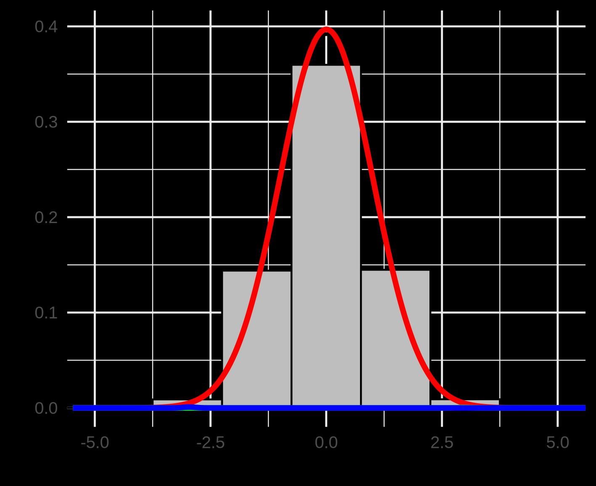
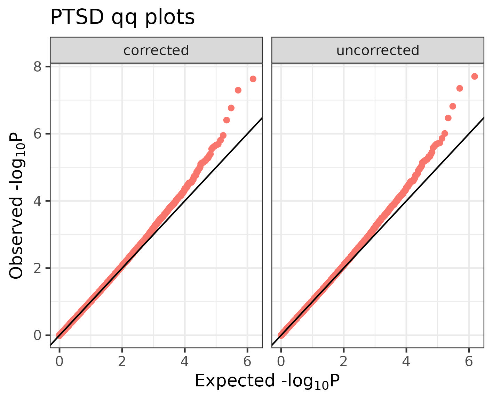
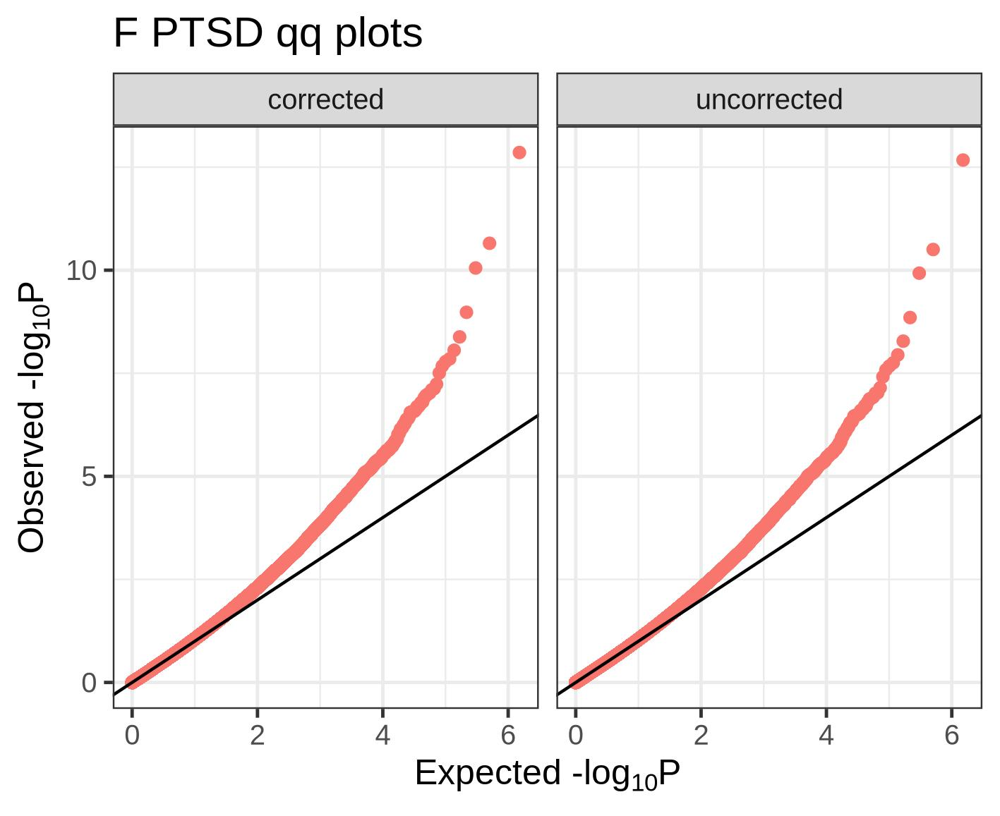
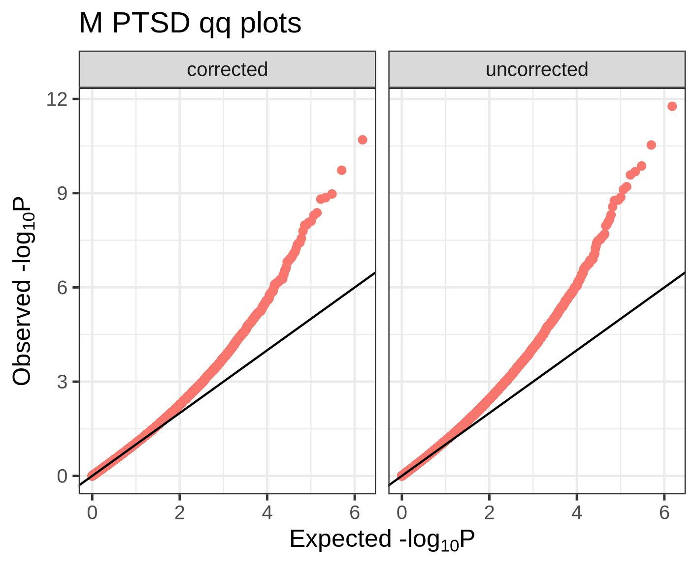
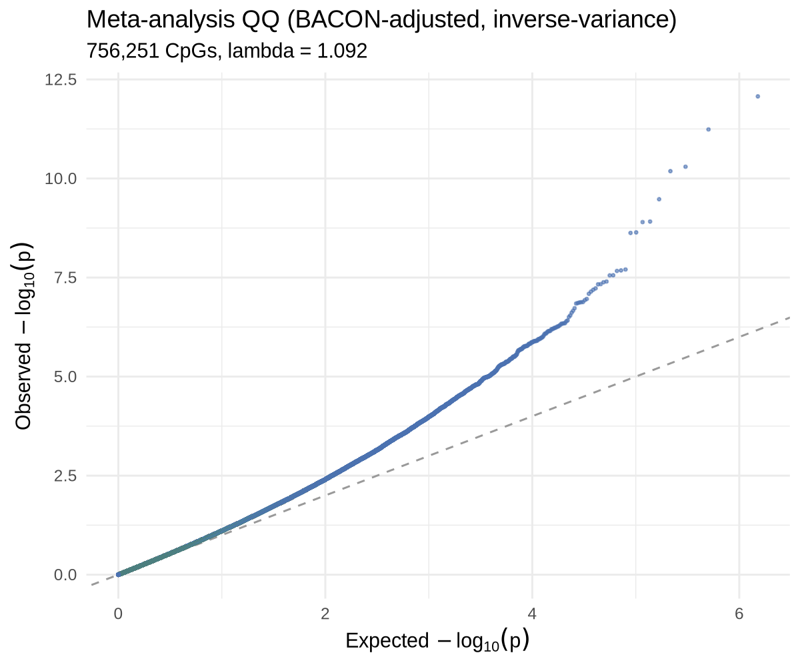
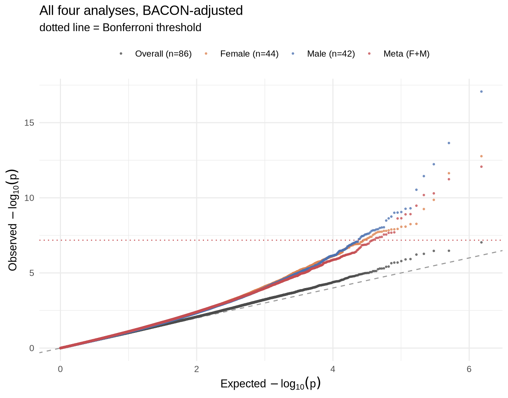
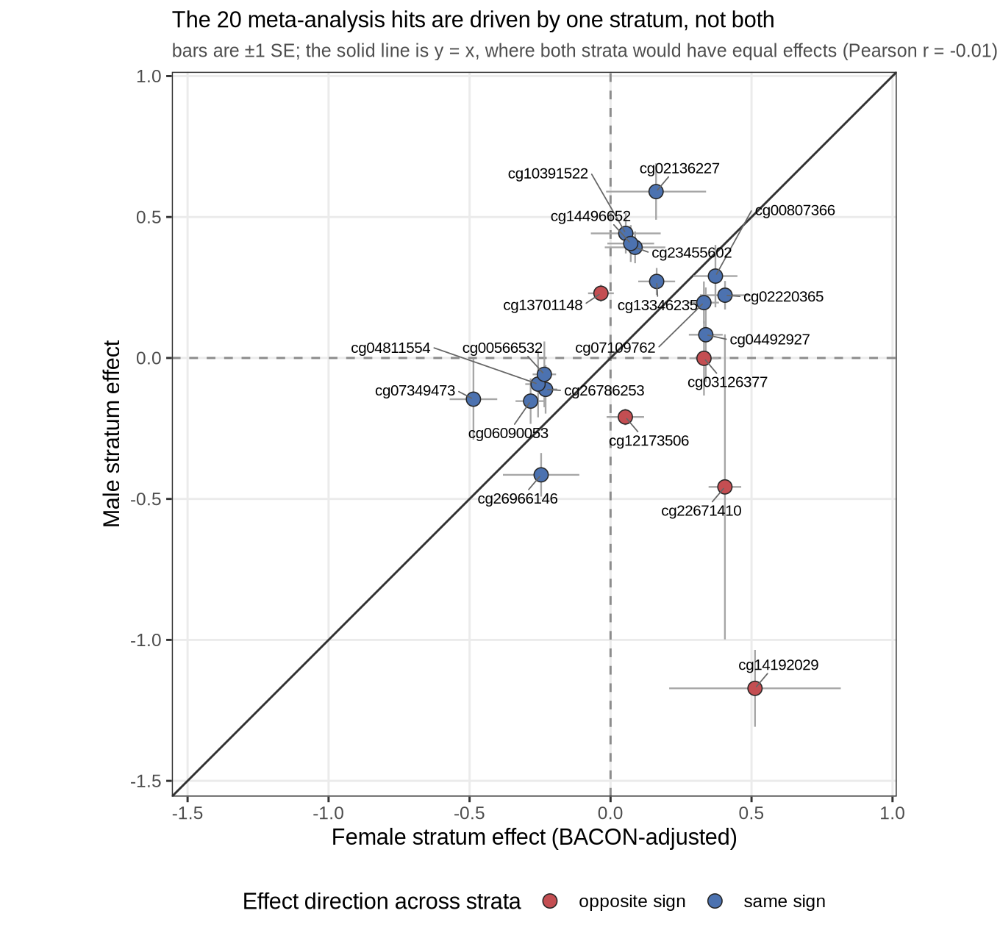

```{r}
#| label: setup
#| include: false
source("_setup.R")
library(data.table)
```

The previous notebook fit a single association model interactively with `limma`.
Here we introduce using a scalable, reproducible Snakemake pipeline for running 
an EWAS. The pipeline automatically handles stratification, meta-analysis, annotation 
of results, and basic plotting of results (manhattan and qq plot). In addition, it can 
run a differentially methylated region (DMR) analysis. The pipeline utilizes parallelization 
and can be run on your local computer or on an remote high performance computing cluster. 
The EWAS Snakemake pipeline with installation and run instructions can be found at:
[github.com/krferrier/EWAS](https://github.com/krferrier/EWAS).

We run the whole thing here on the same Grady subset we have been using — the 87
samples with complete covariate data — across the **full filtered probe set**
(756,251 CpGs), the same matrix and the same model chapter 06 fit interactively.


## 1. The pipeline's structure

The repository is a standard Snakemake project. The pieces that matter for a
user:

| Path | Role |
|------|------|
| `config.yml` | **The only file you normally edit** — points at your data, names the association variable, toggles stratification / DMR analysis, sets chunking and compute. |
| `Snakefile` + `rules/*.smk` | The DAG: `combined_ewas`, `stratified_ewas`, `dmr`, `annotate`, `plots`. |
| `scripts/ewas.R` | Fits the per-CpG model over a chunk of CpGs; used for both the combined and stratified runs. |
| `scripts/stratify.R` | Splits the methylation + phenotype tables into per-stratum `.fst` files. |
| `scripts/run_bacon.R` | Applies BACON to a results file; writes adjusted stats + diagnostic plots. |
| `scripts/metal_cmd.sh` | Emits a METAL command file from the stratum results. |
| `software/metal/` | METAL source (built once into a binary). |

The dependency graph, conceptually:

```
             ┌─ combined EWAS ─────────────► BACON ─► plots ─┐
 mvals+pheno ┤                                               ├─► (DMR) ─► annotation
             └─ stratify ─► per-sex EWAS ─► BACON ─► METAL ──┘
                                                    meta-analysis
```

Because it is Snakemake, running `snakemake --cores N` would build every target
in that graph in dependency order and skip anything already up to date. Here we
call the underlying scripts directly, one stage at a time, so you can see what
each rule actually does.

## 2. Configuration

The shipped `config.yml` is annotated for a BMI example; the fields we care about:

```yaml
mvals: data/mvals.csv.gz          # CpG × sample M-value matrix (CpGs in rows)
pheno: data/pheno.csv             # sample × covariate table; col 1 = sample ID
association_variable: PTSD        # the exposure/phenotype to test
stratified_ewas: "yes"            # also run within-stratum analyses
stratify_variables: ["sex"]       # ...stratified by sex
dmr_analysis: "yes"               # region-level analysis after single-CpG
genome_build: hg38                # genome build for annotation
gene_table: refGene
chunk_size: 5000                  # CpGs per parallel task
processing_type: cluster          # sequential | multisession | multicore | cluster
workers: 4
out_type: ".csv.gz"
```

Notes:

- **`association_variable` is the whole experiment.** Everything else in
  `pheno.csv` that is *not* the sample ID or the stratify variable is treated as
  a covariate. This is worth internalising: you control the model by choosing
  the *columns you write into `pheno.csv`*, not by editing a formula anywhere.
  Given the file we build below, the pipeline model is literally
  `methylation ~ PTSD + sex + age + smoke + pos + CD8T + CD4T + NK + Bcell + Mono + Neu + SV1 + ... + SV6`
  — the same model chapter 06 fit with `limma`, which is what lets us compare
  the two implementations at the end of this chapter.
- **`processing_type`** chooses the parallel backend. `cluster` submits chunks as
  jobs on an HPC scheduler; on a single machine you use `multicore` or `multisession`. We use
  `multicore` below so the demo runs locally.

## 3. Preparing the inputs

The pipeline wants two files: a phenotype file and a methylation data file. 
We build them from the preprocessed objects the earlier notebooks produced. 
The input file format can be any standard-delimited file type. For the phenotype 
file I typically use a .csv or .txt format as the file size is usually relatively 
small even without compression. Methylation datasets are typically several GB in size. 
I strongly recommend using some form of compression (e.g. `.csv.gz`). You can pass 
compressed files to the pipeline without issue. In addition to standardized format types,
like .csv, .txt, etc., you can also use '.fst' filetypes (a fast data serialization format) 
which is by far the format type the pipeline can process the fastest. 


```{r}
#| label: show-inputs
#| eval: true
pheno <- fread("../ewas_pipeline/data/pheno.csv")
cat("pheno.csv:", nrow(pheno), "samples x", ncol(pheno), "columns\n")
cat("columns:", paste(names(pheno), collapse = ", "), "\n\n")
cat("PTSD (1=Case, 0=Control):\n"); print(table(pheno$PTSD))
cat("\nsex:\n"); print(table(pheno$sex))
```

```r
# mvals.csv.gz — SAMPLES in rows, CpGs in columns, first column = sample IDs.
# This orientation matters: ewas.R moves the first column to rownames and then
# chunks over the *columns*, so the file must be samples x CpGs, not CpGs x samples.
M <- log2((betas + 1e-3) / (1 - betas + 1e-3))   # betas = filtered matrix, probes x samples
M <- M[complete.cases(M), ]
Mt <- t(M)
data.table::fwrite(data.table(SampleID = rownames(Mt), data.table::as.data.table(Mt)),
                   "data/mvals.csv.gz")
```

This writes the **full filtered probe set** — every CpG that survived Chapter 3. The chunking machinery is what makes that affordable: `ewas.R` reads
the matrix once, splits the CpGs into chunks of `chunk-size`, and distributes chunks
across workers, so memory stays flat as the probe count grows.

## 4. Building METAL

METAL is distributed as C++ source. The pipeline vendors it under
`software/metal/` and builds it once:

```bash
cd software/metal
tar -xzf METAL.tar.gz --strip-components=1
cmake -S . -B build -DCMAKE_BUILD_TYPE=Release
cmake --build build
# → software/metal/build/metal/metal
```

This installation/build is automatically handled by the Snakemake pipeline. 

## 5. Running a non-stratified EWAS

If you don't want to stratify your EWAS by any terms, the pipeline begins 
running the EWAS across all 87 complete-data samples with the `ewas.R` script.
This script reads the methylation matrix in chunks, fits one `glm` per CpG, and
uses the `PTSD` term as the main predictor to test for association:

```bash
Rscript scripts/ewas.R \
  --pheno data/pheno.csv --methyl data/mvals.csv.gz \
  --assoc PTSD --stratified no \
  --chunk-size 5000 --processing-type multicore --workers 4 \
  --out-dir run_grady/all --out-prefix all --out-type .csv.gz
# → run_grady/all/PTSD_ewas_results.csv.gz   (756,251 CpGs, ~1.9 h — see note)
```


## Does the pipeline agree with chapter 06?

It should, and checking is a good habit whenever you move an analysis between
implementations. Chapter 06 fit this model with `limma::lmFit` + `eBayes`; the
pipeline fits one `glm` per CpG. On this run:

- **Effect estimates are identical** — the largest disagreement between the
  pipeline's `estimate` and limma's `logFC` across all 756,251 CpGs is
  8.9 × 10⁻¹⁵, i.e. floating-point noise. Same design matrix, same least-squares
  solution.
- **Both reference the same *t* distribution** with 63 residual degrees of
  freedom.
- **The p-values still differ slightly** (correlation 0.999 on the −log₁₀ scale;
  λ = 1.021 either way). The reason is `eBayes`: limma shrinks each probe's
  residual variance toward a prior fitted across all probes, so its standard
  errors differ from the per-probe `glm` ones by up to ~22%. Neither is wrong —
  moderation buys stability at small *n*, which is why limma is a good choice for
  interactive work, while the per-probe fit is the more transparent default for a
  production pipeline.

Identical point estimates plus a small, explainable difference in the variance
model is exactly what a successful port looks like. Estimates that *disagree*
would mean the covariate columns differ between the two runs.


```{r}
#| label: load-all
allres <- fread("../ewas_pipeline/run_grady/all/PTSD_ewas_results.csv.gz")
cat("columns:", paste(names(allres), collapse = ", "), "\n")
cat("n CpGs:", nrow(allres), " | samples per model (n):", allres$n[1], "\n")
setorder(allres, p.value)
print(head(allres[, .(cpgid, estimate, std.error, statistic, p.value)], 5))
```

## 6. Stratifying by sex, then running each stratum

If you want to run a stratified EWAS, you first run `stratify.R` on your variable(s) 
that you'd like to stratify by. The script splits both the phenotype and methylation 
tables by the stratify variable(s) and drops that variable from the phenotype file before 
being passed on to the EWAS step. 

```bash
Rscript scripts/stratify.R --stratify sex --out-dir run_grady/strat --threads 4
# → run_grady/strat/F/{F_mvals.fst, F_pheno.fst}
# → run_grady/strat/M/{M_mvals.fst, M_pheno.fst}

for S in F M; do
  Rscript scripts/ewas.R \
    --pheno run_grady/strat/$S/${S}_pheno.fst \
    --methyl run_grady/strat/$S/${S}_mvals.fst \
    --assoc PTSD --stratified yes \
    --chunk-size 5000 --processing-type multicore --workers 4 \
    --out-dir run_grady/strat/$S --out-prefix $S --out-type .csv.gz
done
# → run_grady/strat/F/F_PTSD_ewas_results.csv.gz  (n = 45)
# → run_grady/strat/M/M_PTSD_ewas_results.csv.gz  (n = 42)
```

The female stratum has 45 samples, the male 42. Each within-stratum model is now
`methylation ~ PTSD + age + cell composition`.

## 7. BACON: correcting residual inflation and bias

A well-specified EWAS should have a genomic-inflation factor `λ ≈ 1` and a QQ
plot on the diagonal until the extreme tail. In practice small-sample EWAS often
show *deflation* (`λ < 1`) or a slight bias in the test-statistic distribution
that covariate adjustment does not fix. **BACON** [@vanIterson2017bacon] fits a
three-component Gaussian mixture to the test statistics by Gibbs sampling,
estimates the bias (mean) and inflation (SD) of the *null* component, and rescales
every statistic accordingly. The pipeline runs it on each analysis (or just the output
EWAS results if no stratification is done):

```bash
for R in all strat/F strat/M; do
  Rscript scripts/run_bacon.R \
    -i run_grady/$R/*_PTSD_ewas_results.csv.gz \
    --out-dir run_grady/$R --out-type .csv.gz
done
```

`run_bacon.R` uses fixed priors and seeds (`niter = 5000`, `nburnin = 2000`,
`globalSeed = 42`) so the correction is reproducible, and it writes four
diagnostic plots per analysis (mixture fit, MCMC traces, posteriors, and a
before/after QQ). It appends `bacon.pval`, `bacon.es`, `bacon.se`,
`bacon.statistic`, and the pre/post `lambda`/`b.lambda` to the results.

Here is what BACON did to the genomic inflation in each arm:

```{r}
#| label: lambda-table
summ <- fread("data/07_pipeline_summary.csv")
print(summ[, .(Analysis, n, lambda_raw = round(lambda_raw, 3),
               lambda_bacon = round(lambda_bacon, 3),
               n_P_lt_1e5, top_cpg, top_P = signif(top_P, 3))])
```

The raw λ values start close to 1 but pull in *opposite directions* across the
strata: 1.021 in the combined arm, 0.967 in females (mildly deflated), 1.070 in
males (mildly inflated). BACON pulls all three to within 1.5% of 1.0 — 1.023 /
1.014 / 1.013 — which is the behavior you want from it: a small, symmetric
correction of residual bias, not a rescue of a badly specified model.

Note that the male arm needed the largest correction. With 42 samples and the
same covariate count, it has the least residual signal to estimate a variance
from, so its test statistics are the most over-dispersed to begin with. This is
the general pattern in stratified EWAS — the smaller stratum is the one whose
λ you should look at hardest.

The mixture fit and the before/after QQ for the overall analysis:

::: {layout-ncol=2}
{#fig-bacon-fit}

{#fig-bacon-qq}
:::

The two stratum QQs after correction:

::: {layout-ncol=2}
{#fig-f-qq}

{#fig-m-qq}
:::

::: {.callout-important}
## BACON is not a license to ignore λ
BACON corrects the *distribution* of test statistics; it does not manufacture
signal. If your λ is inflated because of unmodeled batch or cell composition,
the right response is to fix the model (P4, P5), not to lean on BACON. Use it for
the residual bias that remains after honest adjustment — which is exactly the
mild deflation we see here.
:::

## 8. Meta-analyzing the strata with METAL

Now we combine the two sex-specific results with **METAL** [@willer2010metal].
Because the pipeline wrote its columns with the labels METAL expects, generating the
command file is simple:

```bash
bash scripts/metal_cmd.sh \
  run_grady/meta_analysis/PTSD_metal_commands.txt \
  run_grady/meta_analysis/PTSD_ewas_meta_analysis_results_ \
  run_grady/strat/F/F_PTSD_ewas_bacon_results.csv.gz \
  run_grady/strat/M/M_PTSD_ewas_bacon_results.csv.gz

software/metal/build/metal/metal run_grady/meta_analysis/PTSD_metal_commands.txt
```

The generated command file tells METAL to run an **inverse-variance** (`SCHEME
STDERR`) meta-analysis, reading the **BACON-adjusted** effect, SE, and p-value
columns, weighting by `n`, and testing for **heterogeneity** across the sexes:

```
SCHEME STDERR
SEPARATOR COMMA
PVALUELABEL bacon.pval
EFFECTLABEL  bacon.es
STDERRLABEL  bacon.se
MARKER cpgid
WEIGHT n
PROCESSFILE .../F_PTSD_ewas_bacon_results.csv.gz
PROCESSFILE .../M_PTSD_ewas_bacon_results.csv.gz
ANALYZE HETEROGENEITY
```

```{r}
#| label: load-meta
meta <- fread("../ewas_pipeline/run_grady/meta_analysis/PTSD_ewas_meta_analysis_results_1.txt")
setorder(meta, `P-value`)
cat("markers meta-analyzed:", nrow(meta), "\n\n")
print(head(meta[, .(MarkerName, Effect, StdErr, `P-value`, Direction,
                    HetISq, HetPVal)], 6))
```

Output columns from METAL to note:

- **`Direction`** is one character per input file (`F` then `M`). `++` or `--`
  means the effect pointed the same way in both sexes; `+-` or `-+` means it
  flipped. The top hit **cg22671410** is `+-`, P = 2.0×10⁻¹³ — and that mismatch
  between a tiny p-value and a discordant direction is the single most important
  thing to notice on this page. Read on.
- **`HetISq` / `HetPVal`** quantify how much the two strata *disagree*.
  A large `HetISq` with small `HetPVal` flags a CpG whose PTSD association differs
  by sex — precisely the situation a sex-adjusted (non-stratified) model would
  hide.

::: {.callout-warning}
## A small p-value from a two-study meta-analysis is not evidence of replication

Nine CpGs clear Bonferroni in the meta-analysis. **Eight of the nine are driven
by one stratum alone**, with the other stratum's p-value above 0.05:

| CpG | Direction | Meta P | Female P | Male P | HetI² |
|---|---|---|---|---|---|
| cg22671410 | `+-` | 2.0×10⁻¹³ | 1.4×10⁻¹³ | 0.91 | 0.0 |
| cg03126377 | `++` | 1.4×10⁻¹⁰ | 2.2×10⁻¹¹ | 0.79 | 72.7 |
| cg08002657 | `--` | 4.2×10⁻¹⁰ | 0.32 | 1.9×10⁻¹⁰ | 61.7 |
| cg25298683 | `--` | 3.7×10⁻⁹ | 8.9×10⁻¹¹ | 0.97 | 86.3 |
| cg08907819 | `++` | 3.9×10⁻⁹ | 0.059 | 5.1×10⁻⁹ | 67.2 |
| cg12248040 | `++` | 2.2×10⁻⁸ | 0.22 | 1.1×10⁻⁹ | 86.4 |
| cg09473383 | `++` | 2.9×10⁻⁸ | 9.5×10⁻⁸ | 0.050 | 34.5 |
| cg21102739 | `--` | 3.1×10⁻⁸ | 1.1×10⁻⁷ | 0.11 | 0.0 |
| cg24256418 | `-+` | 4.4×10⁻⁸ | 4.2×10⁻⁹ | 0.78 | 78.5 |

Inverse-variance meta-analysis is a *weighted average*, not a concordance test.
A single stratum with a large effect and a small SE can carry the pooled estimate
past a genome-wide threshold on its own, and the pooled p-value says nothing
about whether the second stratum agreed. Only `cg21102739` is nominally
significant in both arms with matching sign — and even that one is under-powered.

This is why you read `Direction` and `HetISq` alongside `P-value`, never instead
of it. Two useful reflexes:

1. **Check the arms.** For every hit you plan to report, look up the per-stratum
   estimate, SE, and p-value. If one arm is flat, you have a stratum-specific
   finding and you should describe it that way.
2. **Distrust `HetISq` at *k* = 2.** With two studies and one heterogeneity
   degree of freedom, I² is extremely noisy. `cg22671410` has I² = 0.0 despite
   effects of +0.40 and −0.06, because the male SE is so large (0.51) that the
   two estimates are statistically compatible with each other. Low I² here means
   "not enough precision to tell them apart", not "they agree".

None of this makes the pipeline wrong — METAL did exactly what it was asked to.
It makes the *interpretation* your responsibility.
:::

```{r}
#| label: meta-summary
lam <- function(p){p<-p[is.finite(p)&p>0]; median(qchisq(p,1,lower.tail=FALSE))/qchisq(0.5,1)}
cat("meta genomic inflation lambda:", round(lam(meta$`P-value`), 3), "\n")
cat("CpGs with heterogeneity P < 0.05:",
    sum(meta$HetPVal < 0.05, na.rm = TRUE),
    sprintf("(%.1f%% — right at the 5%% null expectation)\n",
            100 * mean(meta$HetPVal < 0.05, na.rm = TRUE)))
```

{#fig-meta-qq width=70%}

## 9. Reading the run as a whole

For the purposes of this tutorial, we ran the EWAS without stratification,
the individual sex EWAS results, and the sex-combined meta-analysis EWAS results:

{#fig-qq-overlay width=75%}

{#fig-concordance width=70%}

A few caveats about these results:

- **The combined arm finds one CpG at Bonferroni; the stratified arms and the
  meta-analysis find more.** The single-sex arms have an n that is too small to run
  an EWAS. It is likely that the sex-strata results prior to BACON adjustment were
  quite deflated and after were over-corrected because the BACON adjustment did not perform well.
  This inflation makes it appear as if there are statstically significant results where there are none. This
  inflation is persisted in the meta-analysis results. This is not meant to be an
  argument against doing stratified analyses, but it does bring to light the importance of
  considering whether the sample size of your strata is sufficiently powered to do a stratified analysis.
- **Heterogeneity sits at 5.4%** of CpGs below P = 0.05, against a 5% null
  expectation, with a median I² of 0. There is no evidence of systematic
  sex-differential methylation genome-wide. That does not mean that the heterogeneity
  observed at the extremes is false, but with a sample size this small it does
  warrant further investigation to validate if there are true sex differences at these sites.

The point of the chapter is
that the pipeline executes correctly, reproduces chapter 06's estimates to
floating-point precision, and produces calibrated statistics (λ within 1.5% of
1 in every arm). It is not that PTSD associates with these nine CpGs in 87
people.

## 10. Scaling up

Nothing about the commands changes when you move from this demo to a real study —
you change `config.yml`, not the code:

- Point `mvals`/`pheno` at the full filtered matrix and sample table.
- Set `processing_type: cluster` and give Snakemake a cluster profile; the
  chunking (`chunk_size`) turns each block of CpGs into a scheduler job.
- Add `dmr_analysis: "yes"` and the annotation settings to get region-level
  results and gene annotation on top of the single-CpG output — which is what the
  [next notebook](08_annotation.qmd) covers.
- Run `snakemake --cores N` (or `--profile <cluster>`) once, and every target in
  the DAG — combined EWAS, stratified EWAS, BACON, METAL, DMRs, annotation,
  plots — is built in order from a single reproducible entry point.

That is the payoff of the pipeline: the statistics are identical to what you did
by hand in P6, but the *process* is now a versioned, parallel, one-command
artifact you can hand to a collaborator or a reviewer.

## References {.unnumbered}

::: {#refs}
:::
